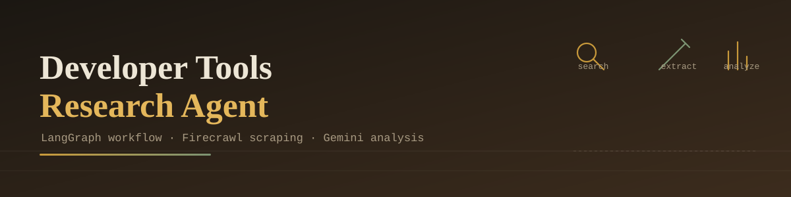
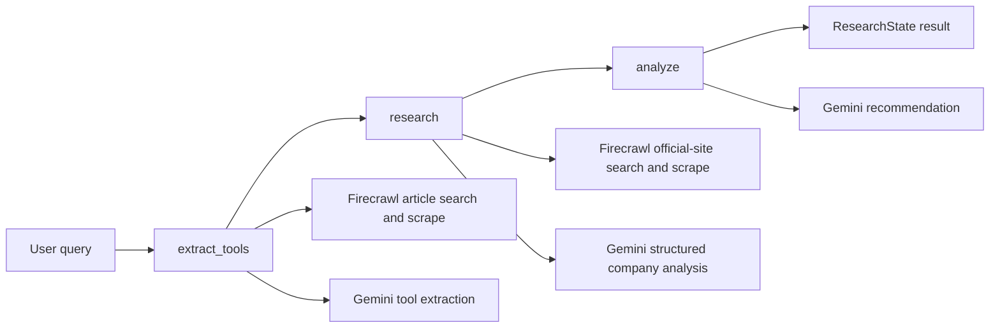

# Developer Tools Research Agent


A command-line, multi-step AI research agent that discovers developer tools, gathers information from the web, analyzes each tool, and generates a concise recommendation.

The project is built with Python, LangChain, LangGraph, Google Gemini, Firecrawl, and Pydantic.

## Features

- Accepts natural-language developer-tool queries from a terminal.
- Searches the web for relevant articles and tool pages with Firecrawl.
- Uses Gemini to extract candidate tools from scraped content.
- Researches up to four tools in detail.
- Produces structured tool information, including:
  - Pricing model
  - Open-source status
  - Technology stack
  - API availability
  - Supported programming languages
  - Integrations
- Generates a short recommendation comparing the researched tools.
- Handles both string and Gemini content-block responses.

## Architecture

The application uses a sequential LangGraph workflow:



### Workflow steps

1. **Extract tools**
   - Builds a search query from the user's request.
   - Uses Firecrawl to find and scrape up to three articles.
   - Sends the collected article text to Gemini.
   - Extracts tool names from the model response.

2. **Research tools**
   - Searches Firecrawl for the official page of each extracted tool.
   - Scrapes the page content.
   - Uses Gemini structured output to populate a `CompanyAnalysis` model.
   - Stores the results as `CompanyInfo` objects.
   - Falls back to search-result titles if extraction returns no tools.

3. **Analyze and recommend**
   - Serializes the researched companies.
   - Sends the data and original query to Gemini.
   - Returns a concise recommendation in the final `ResearchState`.

## Project Structure

```text
coding_research_assistant/
├── .env                    # Local API keys; do not commit
├── .gitignore              # Ignored files and environment folders
├── main.py                 # CLI entry point
├── requirements.txt        # Python dependencies
├── cmdneeded.md             # Local setup notes
├── autocomit.sh            # Optional automatic commit loop
├── README.md               # Project documentation
└── src/
    ├── __init__.py         # Makes src a Python package
    ├── firecrawl.py        # Firecrawl client wrapper
    ├── models.py            # Pydantic state and result models
    ├── prompts.py           # Extraction, analysis, and recommendation prompts
    └── workflow.py          # LangGraph workflow and Gemini calls
```

## Requirements

- Python 3.11 or newer
- A Google Gemini API key
- A Firecrawl API key
- Internet access
- The project's `.venv` virtual environment, or another isolated Python environment

## Setup

### 1. Create or activate the virtual environment

On Windows PowerShell:

```powershell
python -m venv .venv
.\.venv\Scripts\Activate.ps1
```

If the environment already exists:

```powershell
.\.venv\Scripts\Activate.ps1
```

### 2. Install dependencies

```powershell
python -m pip install -r requirements.txt
```

The project currently uses `firecrawl-py==1.14.1`, which matches the `FirecrawlApp.search()` and `FirecrawlApp.scrape_url()` calls in `src/firecrawl.py`.

### 3. Configure environment variables

Create a `.env` file in the project root:

```env
GOOGLE_API_KEY=your_google_gemini_api_key
FIRECRAWL_API_KEY=your_firecrawl_api_key
```

Never commit `.env` or publish these keys. The application loads the file through `python-dotenv`.

## Running the Agent

From the project root:

```powershell
.\.venv\Scripts\Activate.ps1
python main.py
```

Enter a query such as:

```text
best alternative tools for firebase
```

Other useful queries:

```text
best python web frameworks for production REST APIs
open source firebase alternatives
best backend as a service platforms
django vs fastapi vs flask
best tools for building saas applications
```

To stop the program, enter:

```text
exit
```

or:

```text
quit
```

## Example Output

```text
Developer Tools Research Agent

Developer Tools Query: best alternative tools for firebase

1. Supabase
   Website: https://supabase.com/
   Pricing: Freemium
   Open Source: True
   Tech Stack: Postgres, Elixir
   API: Available

2. Appwrite
   Website: https://appwrite.io/
   Pricing: Freemium
   Open Source: True
   Tech Stack: PHP, Docker
   API: Available

Developer Recommendations:
Supabase is a strong pick if you want a Postgres-based backend with row-level
security, while Appwrite offers a simpler self-hosted setup for teams that
prefer a container-based deployment...
```

Actual output depends on search results, scrape availability, and model responses.

## Main Components

### `main.py`

Starts the interactive terminal loop, sends each query to `Workflow.run()`, and prints company details and recommendations.

### `src/workflow.py`

Defines the LangGraph state machine and all model-driven workflow steps. It also contains `_response_text()`, which converts Gemini string or list-based content responses into plain text before processing them.

### `src/firecrawl.py`

Encapsulates Firecrawl operations:

- `search_companies()` searches for relevant pages.
- `scrape_company_pages()` retrieves markdown content.

The wrapper converts Firecrawl responses into the simple response shapes expected by the workflow.

### `src/models.py`

Defines the Pydantic models:

- `CompanyAnalysis`: structured information extracted from one tool page.
- `CompanyInfo`: researched tool information displayed by the CLI.
- `ResearchState`: state passed through the LangGraph workflow.

### `src/prompts.py`

Contains the system and user prompts for tool extraction, company analysis, and recommendations.

## Troubleshooting

### `ModuleNotFoundError: No module named 'firecrawl'`

Use the project virtual environment and install dependencies:

```powershell
.\.venv\Scripts\Activate.ps1
python -m pip install -r requirements.txt
```

Make sure the command is using the same interpreter where the packages were installed:

```powershell
python -c "import sys; print(sys.executable)"
```

### `Missing FIRECRAWL_API_KEY environment variable`

Add `FIRECRAWL_API_KEY` to the root `.env` file and run the command from the project root.

### HTTP 403 during scraping

Some websites, including certain Reddit pages, block automated scraping or are unsupported by Firecrawl. The agent catches the scrape error, but the resulting research may be incomplete. Try a query that leads to official documentation or product pages.

### Unexpected or irrelevant extracted tool names

Tool extraction is based on model output and currently accepts non-empty response lines as candidates. Scraped error pages or blocked-page messages can therefore reduce result quality. Prefer specific queries and inspect scrape errors when results look suspicious.

### Gemini warnings about temperature or automatic function calling

These messages are warnings from the installed Google/LangChain integration. They are separate from Python exceptions. Some Gemini models use fixed sampling defaults, so the configured temperature may be ignored.

## Development Checks

Compile the main modules:

```powershell
.\.venv\Scripts\python.exe -m py_compile main.py src\firecrawl.py src\models.py src\prompts.py src\workflow.py
```

Check installed dependency consistency:

```powershell
.\.venv\Scripts\python.exe -m pip check
```

Check that the workflow imports and constructs successfully:

```powershell
.\.venv\Scripts\python.exe -c "from src.workflow import Workflow; Workflow(); print('workflow construction ok')"
```

## Security Notes

- Keep `.env` out of version control.
- Rotate API keys immediately if they are exposed.
- Do not log API keys or include them in issue reports.
- Treat scraped web content as untrusted input.
- Model-generated recommendations should be reviewed before being used for production architecture decisions.

## Limitations and Future Improvements

- Add tests for Firecrawl response normalization and Gemini content normalization.
- Validate extracted names before researching them.
- Filter blocked-page and scrape-error messages before sending content to Gemini.
- Preserve source URLs and citations in the final result.
- Add retry, timeout, and rate-limit handling.
- Use structured output for the final recommendation as well.
- Add a web interface or API around the workflow.
- Improve fallback behavior when all candidate pages fail to scrape.

## License

No license file is currently included in this repository. Add a license before distributing the project publicly.
